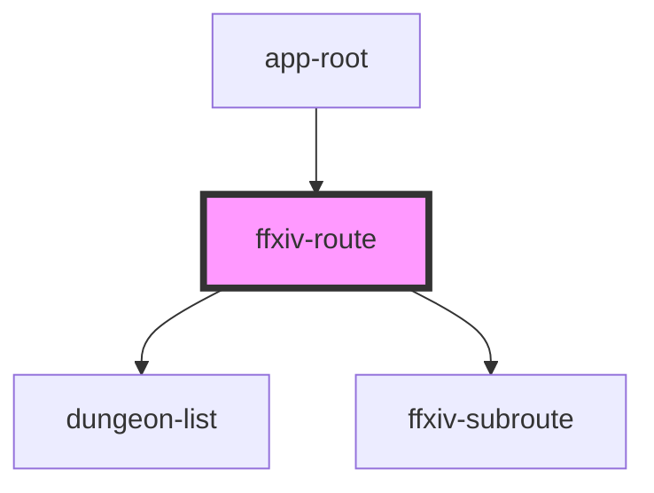

# my-component

<!-- Auto Generated Below -->

## Properties

| Property    | Attribute   | Description | Type       | Default     |
| ----------- | ----------- | ----------- | ---------- | ----------- |
| `favorites` | --          |             | `string[]` | `undefined` |
| `freeDest`  | `free-dest` |             | `string`   | `undefined` |
| `home`      | `home`      |             | `string`   | `undefined` |

## Dependencies

### Used by

 - [app-root](../app-root)

### Depends on

- [dungeon-list](../dungeon-list)
- [ffxiv-subroute](../ffxiv-subroute)

### Graph

----------------------------------------------

*Built with [StencilJS](https://stenciljs.com/)*
