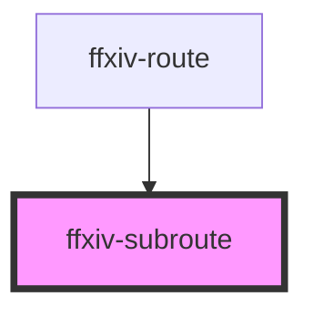

# ffxiv-subroute

<!-- Auto Generated Below -->

## Properties

| Property | Attribute | Description | Type  | Default     |
| -------- | --------- | ----------- | ----- | ----------- |
| `data`   | `data`    |             | `any` | `undefined` |
| `home`   | `home`    |             | `any` | `undefined` |

## Dependencies

### Used by

 - [ffxiv-route](../ffxiv-route)

### Graph

----------------------------------------------

*Built with [StencilJS](https://stenciljs.com/)*
